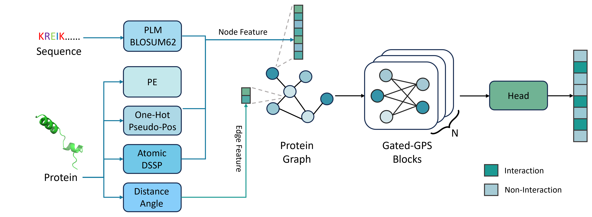

# Gated-GPS: enhancing protein–protein interaction site prediction with scalable learning and imbalance-aware optimization



Gated-GPS is a deep learning framework designed to enhance the prediction of protein–protein interaction (PPI) sites. It leverages scalable learning techniques and imbalance-aware optimization to improve accuracy in identifying interaction sites from protein sequences.

## Project Structure

- `create_env.sh`: Script to set up the Python environment using Conda.
- `train.sh`: Shell script for training the model.
- `inference.py`: Script for performing inference using a trained model.
- `fig/main.png`: Visualization of the proposed method.
- Google Drive folder: Contains all necessary datasets and pretrained model weights (see below).

## Setup Instructions

### Step 1: Download Required Files

Please download **all contents** from the following Google Drive folder:

[Google Drive – Data & Weights](https://drive.google.com/drive/folders/16Y5NnKyFZC8QMannnTG0ApcPLRTBUJX0?usp=sharing)

Then organize them in your local project directory as follows:

```bash
# Create necessary directories if they don't exist
mkdir -p datasets/feature

# Move files accordingly:
# - Place model checkpoint (.ckpt) in the root directory
# - Place *.pkl files in datasets/
# - Extract *.tar.gz files into datasets/feature/
# - Place bound_unbound_mapping.txt in datasets/feature/
````

Ensure the directory structure looks like this:

```
Gated-GPS/
├── create_env.sh
├── train.sh
├── inference.py
├── ckpt
├── datasets/
│   ├── *.pkl
|   ├── bound_unbound_mapping.txt
│   └── feature/
│       ├── feature_test_60/
│       ├── feature_test_315/
│       └── feature_ubtest_31/
```

### Step 2: Create Environment

To create the required Conda environment, run:

```bash
cd Gated-GPS
./create_env.sh
````

### Step 2.5: Training Set Configuration

**Important Note about Training Data:**

The full training set (Train_2771) includes data points from PDBbind, which is a database of protein-ligand binding affinity data. Due to licensing restrictions, we cannot redistribute this data publicly. Therefore, we only provide the small-scale training set (Train_334) for demonstration purposes.

If you wish to use the provided small-scale dataset instead of the full training set:

1. Open `train.py`
2. Comment out the current training set creation (lines 327-333)
3. Uncomment the alternative training set creation (lines 336-342)

The code should look like this after modification:

```python
# Comment out the full training set
# train_set = ProDataset(
#     pe_dim=args.pe_dim,
#     esm_name=args.esm_name,
#     esm_layers=args.esm_layers,
#     esm_model_path=args.esm_model_path,
#     feature_path="datasets/feature/feature_train_2771/"
# )

# Uncomment the small-scale training set
train_set = ProDataset(
    pe_dim=args.pe_dim,
    esm_name=args.esm_name,
    esm_layers=args.esm_layers,
    esm_model_path=args.esm_model_path,
    feature_path="datasets/feature/feature_train_334/"
)
```

### Step 3: Inference

To perform inference using pretrained models:

```bash
python inference.py
```

**Note**: The pretrained checkpoint uses ESM2-650M (esm2_t33_650M) by default for protein sequence embeddings.

## Citation

If you find this project helpful for your research, please consider citing the following work:

```bibtex
@article{gao2025gated,
  title={Gated-GPS: enhancing protein--protein interaction site prediction with scalable learning and imbalance-aware optimization},
  author={Gao, Xin and Cao, Hanqun and Li, Jinpeng and Qiu, Jiezhong and Chen, Guangyong and Heng, Pheng-Ann},
  journal={Briefings in Bioinformatics},
  volume={26},
  number={3},
  pages={bbaf248},
  year={2025},
  publisher={Oxford University Press}
}
```

## Contact

For questions or collaborations, please contact:

[xig022@ucsd.edu](mailto:xig022@ucsd.edu), [ljpadam@gmail.com](mailto:ljpadam@gmail.com)
